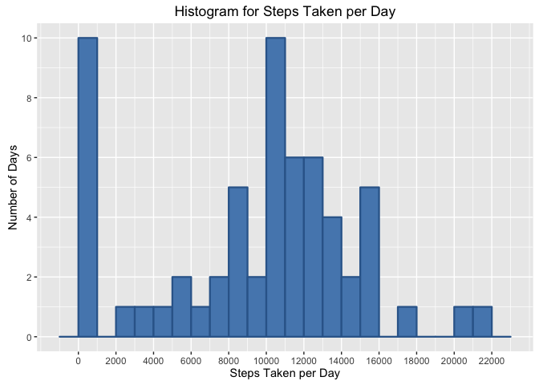
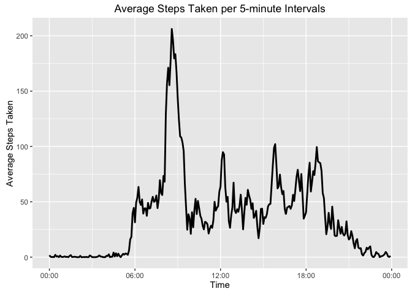
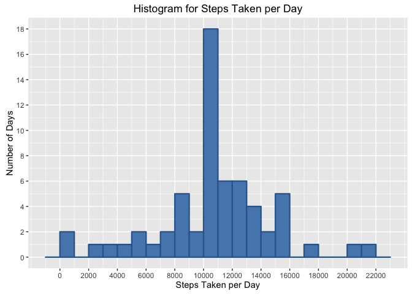
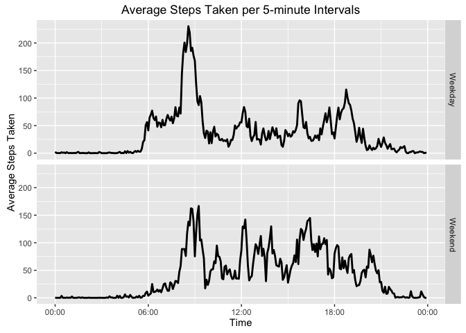

# Reproducible Research: Peer Assessment 1

## Initialization

This step involves loading required libraries, setting the working directory, and making other
adjustments so our code will function properly:

```r
packages <- c("data.table", "ggplot2", "scales", "stringr")
sapply(packages, require, character.only = TRUE, warn.conflicts = FALSE, quietly = TRUE)
```

```
## data.table    ggplot2     scales    stringr 
##       TRUE       TRUE       TRUE       TRUE
```

```r
previousWD <- getwd()
newWD <- getSrcDirectory(function(x) {x})
setwd(newWD)

options(datatable.print.nrows = 50)
```

## Loading and preprocessing the data

#### 1) Load the data

In this assignment, we use the `data.table` package, which provides high performance file loading
and methods to process tabular data. Since the data file is zipped, we first unzip it, then read the
data file, using the `fread()` function. Once the data is loaded, the CSV data file is deleted.

```r
dataFileName <- "activity.csv"
zipFIlename <- "activity.zip"
dataFile <- unzip(zipFIlename)
data <- fread(dataFileName)
unlink(dataFile)
print(data)
```

```
##        steps       date interval
##     1:    NA 2012-10-01        0
##     2:    NA 2012-10-01        5
##     3:    NA 2012-10-01       10
##     4:    NA 2012-10-01       15
##     5:    NA 2012-10-01       20
##    ---                          
## 17564:    NA 2012-11-30     2335
## 17565:    NA 2012-11-30     2340
## 17566:    NA 2012-11-30     2345
## 17567:    NA 2012-11-30     2350
## 17568:    NA 2012-11-30     2355
```

#### 2) Process/transform the data (if necessary) into a format suitable for your analysis

At this point, no further processing is required.

## What is mean total number of steps taken per day?

#### 1) Calculate the total number of steps taken per day

This can be accomplished in a single line of code using the built-in `data.table` syntax.


```r
stepsPerDay <- data[, .(total = sum(steps, na.rm = TRUE)), by = .(date)]
print(stepsPerDay)
```

```
##           date total
##  1: 2012-10-01     0
##  2: 2012-10-02   126
##  3: 2012-10-03 11352
##  4: 2012-10-04 12116
##  5: 2012-10-05 13294
## ---                 
## 57: 2012-11-26 11162
## 58: 2012-11-27 13646
## 59: 2012-11-28 10183
## 60: 2012-11-29  7047
## 61: 2012-11-30     0
```

#### 2) Make a histogram of the total number of steps taken each day

For all graphics in this report, we'll use the `ggplot2` package.


```r
g <- ggplot(stepsPerDay, aes(total)) + 
  geom_histogram(fill = "#5588BB", color = "#336699", size = 0.8, binwidth = 1000) + 
  labs(x = "Steps Taken per Day", y = "Number of Days", title = "Histogram for Steps Taken per Day") + 
  scale_x_continuous(breaks = seq(0, 22000, 2000)) + 
  scale_y_continuous(breaks = seq(0, 10, 2))
print(g)
```



#### 3) Calculate and report the mean and median of the total number of steps taken per day

Again, the `data.table` syntax helps us calculate these results with a single line of code.

```r
meanMedian <- stepsPerDay[, .(mean = mean(total), median = median(total))]
print(meanMedian)
```

```
##       mean median
## 1: 9354.23  10395
```

## What is the average daily activity pattern?

#### 1) Make a time series plot of the 5-minute interval (x-axis) and the average number of steps taken, averaged across all days (y-axis)

First, we must calculate the average number of steps for each 5-minute interval, across all days in the dataset.
Note that we create a new column in the result data table with the time interval padded with
leading zeros. Therefore, strings like `10` become `0010`. We do that using the `str_pad()` function
in the `stringr` package. The reason for this transformation will become clear in the next step:

```r
avgFiveMinuteInt <- data[, .(mean = mean(steps, na.rm = TRUE), time = str_pad(interval, 4, pad = "0")), 
                         by = .(interval)]
print(avgFiveMinuteInt)
```

```
##      interval      mean time
##   1:        0 1.7169811 0000
##   2:        5 0.3396226 0005
##   3:       10 0.1320755 0010
##   4:       15 0.1509434 0015
##   5:       20 0.0754717 0020
##  ---                        
## 284:     2335 4.6981132 2335
## 285:     2340 3.3018868 2340
## 286:     2345 0.6415094 2345
## 287:     2350 0.2264151 2350
## 288:     2355 1.0754717 2355
```

In order to present the plot x-axis scale in a more meaningful way (i.e. in the `%hh:%mm` format),
we calculate an auxiliary character vector that takes the padded time interval strings from the 
`avgFiveMinuteInt` table and gererates Date/Time objects from them (note the date is not important. 
We are only interested in the time, but the `timeVector` is of class `POSIXlt`, so both date and time
are shown):

```r
timeVector <- as.data.table(strptime(avgFiveMinuteInt$time, "%H%M"))
print(timeVector)
```

```
##                        x
##   1: 2016-04-03 00:00:00
##   2: 2016-04-03 00:05:00
##   3: 2016-04-03 00:10:00
##   4: 2016-04-03 00:15:00
##   5: 2016-04-03 00:20:00
##  ---                    
## 284: 2016-04-03 23:35:00
## 285: 2016-04-03 23:40:00
## 286: 2016-04-03 23:45:00
## 287: 2016-04-03 23:50:00
## 288: 2016-04-03 23:55:00
```

Finally, we can plot the data series, using the `timeVector` as labels for the x-axis, after proper
formatting with the `date_format()` function of the `scales` package:

```r
g <- ggplot(avgFiveMinuteInt, aes(timeVector, mean)) + 
  geom_line(size = 1) + 
  labs(x = "Time", y = "Average Steps Taken", title = "Average Steps Taken per 5-minute Intervals") + 
  scale_x_datetime(labels=date_format("%H:%M", tz = Sys.timezone()))
print(g)
```



#### 2) Which 5-minute interval, on average across all the days in the dataset, contains the maximum number of steps?


```r
maxSteps <- avgFiveMinuteInt[which.max(mean), .(interval, mean)]
print(maxSteps)
```

```
##    interval     mean
## 1:      835 206.1698
```

## Imputing missing values

#### 1) Calculate and report the total number of missing values in the dataset (i.e. the total number of rows with NAs)


```r
numNAs <- sum(is.na(data$steps))
print(numNAs)
```

```
## [1] 2304
```

#### 2) Devise a strategy for filling in all of the missing values in the dataset.

In my analysis, the imputing strategy for `NA` values consisted of using the mean value for that
particular 5-minute interval across all days. One efficient way of doing this is merging the `data` and the
`avgFiveMinuteInt` tables to create one bigger data table with separate columns for the actual
number of steps taken in each 5-minute interval and the mean for that same interval. This is done
using the `data.table` join syntax.


```r
setkey(data, interval)
setkey(avgFiveMinuteInt, interval)
filledData <- data[avgFiveMinuteInt]
print(filledData)
```

```
##        steps       date interval     mean time
##     1:    NA 2012-10-01        0 1.716981 0000
##     2:     0 2012-10-02        0 1.716981 0000
##     3:     0 2012-10-03        0 1.716981 0000
##     4:    47 2012-10-04        0 1.716981 0000
##     5:     0 2012-10-05        0 1.716981 0000
##    ---                                        
## 17564:     0 2012-11-26     2355 1.075472 2355
## 17565:     0 2012-11-27     2355 1.075472 2355
## 17566:     0 2012-11-28     2355 1.075472 2355
## 17567:     0 2012-11-29     2355 1.075472 2355
## 17568:    NA 2012-11-30     2355 1.075472 2355
```

#### 3) Create a new dataset that is equal to the original dataset but with the missing data filled in.

Since the `NA` values a going to be filled with the mean for that 5-minute interval (a floating
point number), we must first convert the `steps` column to `double`:


```r
filledData$steps <- as.double(filledData$steps)
```

Finally, whe filter the table to find all rows where `steps == NA` and copy the value of the `mean`
column to the `steps` column:

```r
filledData[is.na(steps), steps := mean]
```

To make the final data a little bit cleaner, we then remove the `mean` column and sort the new table
across the `date` column:


```r
filledData <- filledData[, .(steps, date, interval)]
setkey(filledData, date)
print(filledData)
```

```
##            steps       date interval
##     1: 1.7169811 2012-10-01        0
##     2: 0.3396226 2012-10-01        5
##     3: 0.1320755 2012-10-01       10
##     4: 0.1509434 2012-10-01       15
##     5: 0.0754717 2012-10-01       20
##    ---                              
## 17564: 4.6981132 2012-11-30     2335
## 17565: 3.3018868 2012-11-30     2340
## 17566: 0.6415094 2012-11-30     2345
## 17567: 0.2264151 2012-11-30     2350
## 17568: 1.0754717 2012-11-30     2355
```

We can see the new table has no remaining `NA` values:

```r
sum(is.na(filledData))
```

```
## [1] 0
```

#### 4) Make a histogram of the total number of steps taken each day and calculate and report the mean and median total number of steps taken per day. Do these values differ from the estimates from the first part of the assignment? What is the impact of imputing missing data on the estimates of the total daily number of steps?

In order to differentiate from the preivous calculated values, we'll add a common suffix to the values
calculated in this step. The calculation process is otherwise the same as done before, but using the
`filledDate` vector instead.


```r
stepsPerDay2 <- filledData[, .(total = sum(steps, na.rm = T)), by = .(date)]
print(stepsPerDay2)
```

```
##           date    total
##  1: 2012-10-01 10766.19
##  2: 2012-10-02   126.00
##  3: 2012-10-03 11352.00
##  4: 2012-10-04 12116.00
##  5: 2012-10-05 13294.00
## ---                    
## 57: 2012-11-26 11162.00
## 58: 2012-11-27 13646.00
## 59: 2012-11-28 10183.00
## 60: 2012-11-29  7047.00
## 61: 2012-11-30 10766.19
```

```r
g <- ggplot(stepsPerDay2, aes(total)) + 
  geom_histogram(fill = "#5588BB", color = "#336699", size = 0.8, binwidth = 1000) + 
  labs(x = "Steps Taken per Day", y = "Number of Days", title = "Histogram for Steps Taken per Day") + 
  scale_x_continuous(breaks = seq(0, 22000, 2000)) + 
  scale_y_continuous(breaks = seq(0, 18, 2))
print(g)
```



```r
meanMedian2 <- stepsPerDay2[, .(mean = mean(total), median = median(total))]
print(meanMedian2)
```

```
##        mean   median
## 1: 10766.19 10766.19
```

As we can see, the values do differ from the preivously calculated ones. The immediate effect of 
imputing the missing values is to make the mean and median the same.

## Are there differences in activity patterns between weekdays and weekends?

#### 1) Create a new factor variable in the dataset with two levels – “weekday” and “weekend” indicating whether a given date is a weekday or weekend day.

Here again, the `data.table` built-in functions help us adding columns to the dataset with the 
factor values. We'll use the `filledData` table for the calculations below:


```r
Sys.setlocale(locale = "en_US")
```

```
## [1] "en_US/en_US/en_US/C/en_US/pt_BR.UTF-8"
```

```r
filledData[, c("day_of_week", "weekday") := list(weekdays(strptime(date, "%Y-%m-%d")), "Weekday")]
filledData[(day_of_week == "Saturday") | (day_of_week == "Sunday"), weekday := "Weekend"]
print(filledData)
```

```
##            steps       date interval day_of_week weekday
##     1: 1.7169811 2012-10-01        0      Monday Weekday
##     2: 0.3396226 2012-10-01        5      Monday Weekday
##     3: 0.1320755 2012-10-01       10      Monday Weekday
##     4: 0.1509434 2012-10-01       15      Monday Weekday
##     5: 0.0754717 2012-10-01       20      Monday Weekday
##    ---                                                  
## 17564: 4.6981132 2012-11-30     2335      Friday Weekday
## 17565: 3.3018868 2012-11-30     2340      Friday Weekday
## 17566: 0.6415094 2012-11-30     2345      Friday Weekday
## 17567: 0.2264151 2012-11-30     2350      Friday Weekday
## 17568: 1.0754717 2012-11-30     2355      Friday Weekday
```

#### 2) Make a panel plot containing a time series plot of the 5-minute interval (x-axis) and the average number of steps taken, averaged across all weekday days or weekend days (y-axis).

First, we must calculate the new means for every 5-minute interval, using the imputed data and
grouped by the `weekday` column.


```r
avgFiveMinuteInt2 <- filledData[, .(mean = mean(steps, na.rm = T), time = str_pad(interval, 4, pad = "0")), 
                         by = .(interval, weekday)]
print(avgFiveMinuteInt2)
```

```
##      interval weekday        mean time
##   1:        0 Weekday  2.25115304 0000
##   2:        5 Weekday  0.44528302 0005
##   3:       10 Weekday  0.17316562 0010
##   4:       15 Weekday  0.19790356 0015
##   5:       20 Weekday  0.09895178 0020
##  ---                                  
## 572:     2335 Weekend 11.58726415 2335
## 573:     2340 Weekend  6.28773585 2340
## 574:     2345 Weekend  1.70518868 2345
## 575:     2350 Weekend  0.02830189 2350
## 576:     2355 Weekend  0.13443396 2355
```

Now, we use the same strategy as before to calculate a helper vector of Date/Time values to be used
as x-axis labels:

```r
timeVector2 <- as.data.table(strptime(avgFiveMinuteInt2$time, "%H%M"))
print(timeVector2)
```

```
##                        x
##   1: 2016-04-03 00:00:00
##   2: 2016-04-03 00:05:00
##   3: 2016-04-03 00:10:00
##   4: 2016-04-03 00:15:00
##   5: 2016-04-03 00:20:00
##  ---                    
## 572: 2016-04-03 23:35:00
## 573: 2016-04-03 23:40:00
## 574: 2016-04-03 23:45:00
## 575: 2016-04-03 23:50:00
## 576: 2016-04-03 23:55:00
```

Finally, we create the panel plot as explained before:

```r
g <- ggplot(avgFiveMinuteInt2, aes(timeVector2, mean)) + 
  geom_line(size = 1) + 
  labs(x = "Time", y = "Average Steps Taken", 
       title = "Average Steps Taken per 5-minute Intervals") +
  facet_grid(weekday ~ .) + 
  scale_x_datetime(labels=date_format("%H:%M", tz = Sys.timezone()))
print(g)
```



Finally, now that all processing is done, we set the working directory back to what it was at the
beginning of the analysis.

```r
setwd(previousWD)
```

